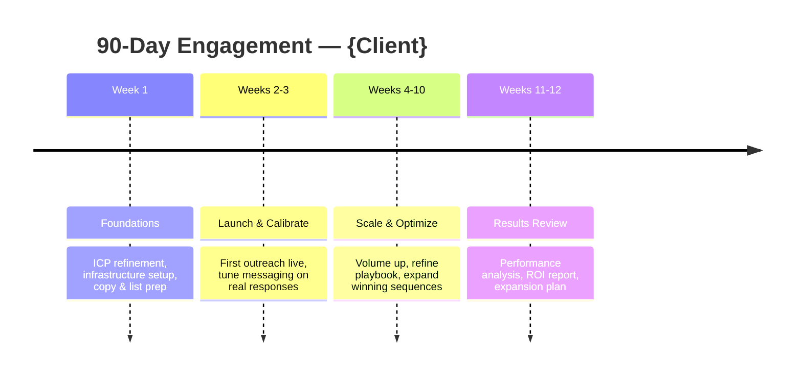

# Outbound Proposal Doc Builder

## Purpose

Given a discovery-call transcript or summary, produces a complete send-ready outbound agency proposal as a Google Doc and drafts the follow-up email. The proposal includes an executive summary, ICP + conversation math, pricing tier(s), 90-day delivery phases, investment table, T&Cs, signature block, and Appendix A (Completed Conversation Criteria). The boilerplate 70% comes from assets; the variable 30% is grounded in what this specific prospect said on this specific call.

## Setup (first use)

On first use, Claude will ask for two things and substitute them throughout the proposal automatically. You don't need to edit any files manually:

1. **Your agency's legal entity name** — used in the T&Cs and signature block
2. **Your real proof points** — past client results, conversation rates, show rates, named logos. The skill ships with placeholder examples (see `references/positioning_and_style.md` lines 66–86) that MUST be replaced with your numbers before sending a proposal to a real prospect

The skill reads these files from the folder you uploaded:

- `assets/terms_and_conditions.md` — T&Cs boilerplate
- `assets/appendix_a_completed_conversation_criteria.md` — Completed Conversations definition
- `references/positioning_and_style.md` — Voice guide + proof point examples (placeholders until you provide yours)

**On every first run for a fresh upload of this skill**, ask the user for their proof points before generating the proposal:

> "Quick one before I draft this — I have placeholder examples in the positioning guide (X% set rate, Y% show rate, etc.). What are your actual numbers? Give me 2–3 specific data points and any named client logos I can reference. I'll use these in the credibility paragraph."

Cache the user's answers in the session and apply them. If the user says "use the defaults" or skips, fall back to generic language ("strong conversion rates", "high show rates") — never use the placeholder numbers as if they were real.

## Getting started

When this skill is loaded, greet the user:

> "I'm the Proposal Builder. I'll draft a complete, ready-to-send proposal for your prospect plus a follow-up email to send with the link.
>
> Share what you have from the discovery call — paste the transcript, a call summary, meeting notes, or share a doc link. Whatever format you have works."

Assume Google Drive is connected with edit access. Proceed straight to the Workflow once the user provides call material.

**Only if doc creation fails**, walk the user through the fix:

- **Google Drive write fails / unauthorized** → "Looks like Google Drive isn't connected with edit access in Cowork. Go to Settings → Connectors → Google Drive, connect your account, and make sure edit permission is enabled. Then tell me you're ready. Or let me know and I'll give you the proposal as formatted text to paste into a doc manually."

If the user describes what they want in plain English instead of providing a transcript (e.g., "I want to send a proposal to a SaaS company for cold calling"), work with it. Ask targeted follow-up questions to fill gaps rather than blocking on a missing transcript.

On first use, ask for the agency legal name as part of Step 3 clarifying questions — don't front-load it before the user has shared their call material.

## Workflow

Follow these steps in order. The proposal is only as good as the parameters set in steps 1–3, so don't rush past them.

### Step 1 — Read inputs thoroughly

Read every attached file in full — call transcript, call summary PDF, any reference proposal the user attached. Extract and hold onto:

- The prospect's business model and primary value proposition
- What was specifically pitched on the call (channels, model, proof points cited)
- Pricing options that were discussed and any commitment levels named
- Concerns the prospect raised (these become things you address in the proposal)
- Decision-maker context — who's signing, who's on the next call
- Next steps the user committed to on the call

If a key fact is missing or ambiguous, plan to ask about it in Step 3 rather than guessing.

### Step 2 — Web-research the prospect

**Default mode (transcript provided):** 1–2 inline web searches is plenty. The proposal is grounded in the call, not market analysis. Look for:

- Recent funding or strategic moves (e.g., "<company> funding 2026", "<company> acquisition")
- Public positioning and ICP signals from their site
- Headline statistics about their market or category

**Deep research mode (thin or no transcript):** if the user only provided a company name + website with no call material, spawn parallel sub-agents using the Agent tool (`Explore` subagent type) — same pattern as `/client-spot` deep research mode. Recommended split:

- Agent 1: Product, positioning, traction milestones, founding story (read their site + recent press)
- Agent 2: Customers, case studies, named logos, segments served
- Agent 3: Market context — competitors, category dynamics, the non-avoidable shift creating urgency now
- Agent 4: Target buyer pain in symptomese — what does their Tuesday afternoon look like (forums, podcasts, LinkedIn, review sites)

Run all in a single message with multiple Agent tool calls. Synthesize when they return.

If the prospect has no meaningful web presence at all, skip this step and lean on the user's call material in Step 3.

### Step 3 — Ask clarifying questions

Use the AskUserQuestion tool. Ask only the questions you don't already have clear answers to from the call and prior conversation. The default question set:

1. **Agency name** — What is your agency's name and legal entity name? (Used in the title block and T&Cs. Example: "YourAgency" / "YourAgency LLC")
2. **Pricing structure** — Which tier(s) to present? Single tier or two side-by-side? Ask the user to confirm the conversation volumes and monthly investment for each tier they want to include.
3. **Channels** — Calling only, email only, or combined? (Default to what was pitched on the call.)
4. **Exclusivity / lead overlap** — Hard exclusivity clause in T&Cs, mention in body with soft language, or defer to next call? (Defer is the safest default unless the user wants to commit.)
5. **Addressee** — Who signs on the company side? Single signer or joint? Open-ended is acceptable.

Phrase options as concrete trade-offs and mark a recommendation if one option is obviously stronger for the situation.

### Step 4 — Draft the markdown content

Build the proposal content as markdown first, in this order:

1. **Title block** — Use this exact layout (plain text, no markdown headings):

   ```
   [Agency Name] Proposal — {Company}
   PROPOSAL
   {Engagement Subtitle}
   {Engagement Tagline}
   PREPARED FOR
   {Company}
   {Contact Full Name}, {Contact Title}
   PREPARED BY
   {Agency Name}
   {Agent Name} — {agent@agency.com}
   {Date}
   ```

   Subtitle examples: "Outbound Lead Generation Engagement", "Fractional SDR Training Engagement"
   Tagline examples: "Cold Calling + Cold Email Pilot", "90-Day Outbound Build-Out"
   Infer contact name and title from the call transcript if not stated directly.
2. **Executive Summary** — Exactly 3 paragraphs:
   - Para 1 (3–5 sentences): What the prospect has built — product, market position, one traction signal. Anchor with **one specific fact from your web research** (recent funding, supplier count, ARR milestone, customer reference). This fact signals you did homework; omitting it signals a template.
   - Para 2 (3–5 sentences): The constraint — almost always pipeline distribution, not the offer. Lead with: *"The product works. The constraint is X."* If they named a specific bad vendor experience on the call, echo it verbatim here.
   - Para 3 (3–5 sentences): One-line investment summary (channels + total) and the projected outcome in numbers, not adjectives.
3. **Our Understanding of the Opportunity** — sub-sections:
   - *What [Prospect] Sells* (4–6 sentences) — product, market position, differentiation. Go deeper than the Exec Summary: mechanics, pricing model, customer types, any economics they shared on the call.
   - *Why [Pipeline / Distribution] Is the Bottleneck (Not the Offer)* (3–5 sentences) — name the underlying motion problem. Tie it to a specific dynamic from the call, not a generic market observation. Include any specific bad experiences they referenced (e.g., "the Branch problem", "chop-shop pattern") — use their words.
   - *Ideal Customer Profile* — 3–5 bullets (format: `- {Concrete ICP filter}`), covering company profile, revenue signals, decision-maker titles, and behavioral triggers. Follow with 1 paragraph (3–5 sentences) on how the list will be built — name specific data sources and signals (e.g., Shopify $1M+ revenue list, Meta ad library signals, Apollo intent filters, LinkedIn targeting). Only reference a prior client campaign by name if it was explicitly mentioned in the call — never fabricate campaign names or numbers.
   - *Conversation Math* — small table mapping conversations/month → projected meetings (use 10–15% set rate, ~75% show rate as working benchmarks). Follow with a benchmark paragraph citing relevant proof points the user mentioned on the call.
4. **Proposed Engagement** — one block per pricing tier or per channel. For each tier/channel, use a 2-column label-value table (Duration, Investment, Projected Meetings, Activated Leads, What's Included).
5. **Optional Add-Ons (for next-call discussion)** — exclusivity/non-compete framing, per-conversation + rev-share possibility, additional participants, anything else flagged for follow-up.
6. **How We Operate** — four phases, each a sub-section with 3–4 bullets:
   - Week 1 — Foundations
   - Weeks 2–3 — Launch and Calibrate
   - Weeks 4–10 — Scale and Optimize
   - Weeks 11–12 — Results Review
7. **Investment Summary** — markdown table summarizing tier(s):

   | Channel | Monthly | Months | Total |
   |---|---|---|---|
   | {Channel 1} | ${X} | {N} | ${Total} |
   | **Total Investment** | ${X} | {N} | **${Total}** |

   Then:
   - *Projected Outcomes* (3–4 bullets): meetings volume, validated playbook, infrastructure built, ICP data. Tailor to scope — no generic bullets.
   - *Payment Terms* (3 bullets, substitute {N} with actual engagement length):
     - Monthly invoicing, due upon receipt.
     - First month due on execution of this agreement to kick off list build and infrastructure.
     - Month-to-month after the initial {N}-day pilot, cancelable with 30 days' notice.
8. **Why [Agency Name]** — 1 paragraph (3–4 sentences) + 4 bullets. The paragraph is nearly verbatim across proposals — adapt only the final clause to the prospect's segment:

   > "[Agency Name] is a revenue-ops and outbound firm focused specifically on founder-led and early-stage B2B sales motions. We run outbound the way top-tier operators run it in-house — with senior callers, infrastructure ownership, and obsessive iteration on what's working in-market this week, not last quarter."

   Then lead with whatever operator credibility is most relevant to this prospect's world before the standard bullets. Standard bullets:
   - **Senior operators.** Callers and GTM operators who have run outbound at scale.
   - **Custom dialing infrastructure.** AI-powered calling produces 8–10x the conversation volume of traditional single-line SDR teams.
   - **Deliverability-first email.** Purpose-built sending domains protect {Company Domain} so your marketing and transactional email stays in the inbox. (Substitute the prospect's domain if you can infer it; otherwise drop the parenthetical.)
   - **Meeting quality > meeting quantity.** We qualify against ICP and intent before booking — no tire-kickers on your calendar.

   See `references/positioning_and_style.md` for proof points and vertical-specific credibility openers.
9. **Terms and Conditions** — read `assets/terms_and_conditions.md` and use verbatim. Update only: `{COMPANY}` → prospect's legal name, `{ENGAGEMENT_DESCRIPTION}` in §1, any agreed-upon exclusivity language in §8. Keep all sections intact.
10. **Next Steps + Acceptance + signature block.**
11. **Appendix A — Completed Conversation Criteria** — read `assets/appendix_a_completed_conversation_criteria.md` and use verbatim.

#### Voice and style

Confident, founder-to-founder, not corporate. Anchored in what this prospect said on this call — not a generic agency pitch.

- Refer to the prospect by company name throughout. Never "you" or "your company."
- When the prospect named a problem ("chop-shop", "tire-kickers", "creative fatigue"), use that word in the proposal. This is the single highest-signal move.
- Every industry observation must tie back to something they said on the call. No generic market takes.
- Em-dashes for emphasis and parenthetical asides (—). No hedging ("we believe", "potentially", "we hope"). No fluffy marketing ("world-class", "industry-leading", "synergy", "best-in-class").
- Short paragraphs: 2–4 sentences. Use bullets only when there are 3+ parallel items — prose feels like a person, over-bulleted decks feel like a vendor.
- Target: 1,500–2,500 words for the dynamic portion (everything before Terms and Conditions).

See `references/positioning_and_style.md` for objection-handling copy, channel vocabulary, and worked examples.

**Claude's own messages** (greetings, clarifying questions, delivery summaries) follow these additional rules:
- No AI-tell openers: "Great question", "Absolutely", "Certainly", "Of course"
- No hedging: "I think", "it seems", "potentially", "it's worth noting"
- No AI vocabulary: "delve", "leverage", "utilize", "robust", "seamless", "comprehensive"
- No em-dashes in Claude's own messages (em-dashes in the proposal body are fine per the style guide above)
- Short. Direct. One idea per sentence.

### Step 5 — Create the Google Doc

Use the Google Drive connector (Settings → Connectors → Google Drive in Cowork) to create and populate the proposal doc. The connector must have write permission enabled.

1. **Create a new Google Doc** titled `[Agency Name] Proposal — {Prospect}` using the connector.
2. **Write the proposal content** from Step 4 into the doc section by section — title block first, then each named section in order. Use the connector's write/append capability for each section.
3. **Capture the doc URL** once creation is confirmed.

If the Google Drive connector is not connected or does not have write permission, output the full proposal as formatted markdown instead and tell the user:

> "Paste this into a new Google Doc titled '[Agency Name] Proposal — {Prospect}'. Enable tabs in Google Docs if you want to keep T&Cs and Appendix A on separate tabs."

### Step 6 — Validate

Read back the doc using the connector and confirm these sections are present and in the right order: title block, Executive Summary, at least one Proposed Engagement pricing block, Investment Summary, Terms & Conditions, and Appendix A. If any section is missing, write it using the connector before proceeding.

### Step 7 — Deliver the doc

Give the user the Google Doc URL and a short prose summary of the structural choices made (which pricing tier(s), how exclusivity was handled, what positioning hook was used). Do not re-summarize the proposal contents — the user can read it.

Include a Mermaid timeline of the 90-day engagement so the user has a single visual to share with the prospect (or paste into a follow-up message). Cowork renders this natively.

````

````

Substitute `{Client}` with the prospect company name.

### Step 8 — Draft the follow-up email

After the doc is delivered, immediately draft the follow-up email. Load `reference/follow-up-email.md` — it contains route selection logic, context variables, voice rules, both route structures with examples, and subject line patterns. Present `subject` and `body` as plain text the user can copy straight into Gmail.

## Assets

- `assets/terms_and_conditions.md` — T&Cs boilerplate. Replace `{AGENCY_LEGAL_NAME}` with your legal entity name once. Then per-proposal: swap `{COMPANY}`, `{ENGAGEMENT_DESCRIPTION}`, `{FEES_LANGUAGE}`, and optional §8 exclusivity addendum language.
- `assets/appendix_a_completed_conversation_criteria.md` — Appendix A defining Completed Conversations + all billable / non-billable disposition criteria.

## References

- `references/positioning_and_style.md` — Voice guide, common objection patterns, and channel-specific vocabulary. Update proof points and worked examples with your agency's actual results.

## Gotchas

- **Don't bake exclusivity into T&Cs unless explicitly asked.** Default is to mention it in the Optional Add-Ons section and add the soft addendum language in §8. Preserving flexibility on commercial terms early in the relationship is usually the right call.
- **Pricing tiers track conversations, not meetings.** The completed-conversations model is the differentiator. Frame meetings as a *projected outcome* of conversation volume, not as the unit of commitment.
- **Reflect their language back.** If the prospect named a specific bad experience or industry term, use it in the proposal. This is the single highest-signal thing you can do.
- **Never fabricate prior campaign references.** Only cite a past client campaign by name if the user explicitly mentioned it in the call context. Making up campaign names or numbers destroys trust if the prospect asks.
- **Write the doc in one pass if possible.** If the connector supports overwrite, use it with the full content. If you write section by section and something gets out of order, re-read the doc and patch the affected section before delivering.
