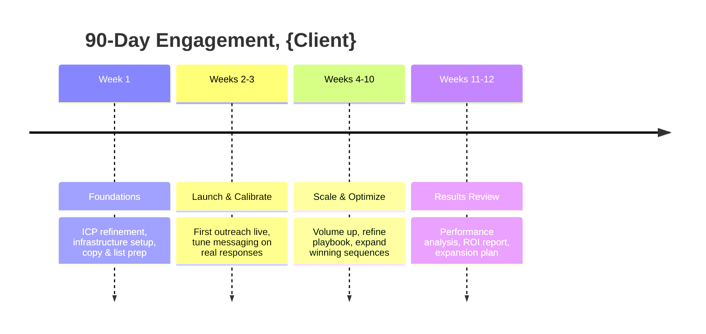

# Outbound Proposal Doc Builder

## Purpose

Given a discovery-call transcript or summary, produces a complete send-ready outbound agency proposal as a fully formatted Word document (`.docx`, ready to open in Google Docs) and drafts the follow-up email. The proposal includes a 4-paragraph executive summary, ICP + conversation math, the compounding value of activated leads, pricing tier(s), 90-day delivery phases, investment table with upfront payment terms, a "beyond the pilot" renewal section, T&Cs, Next Steps + signature block, and Appendix A (Completed Conversation Criteria). The boilerplate 70% comes from assets; the variable 30% is grounded in what this specific prospect said on this specific call.

_Cowork skill - upload the ZIP and run from the Claude desktop app._

## Setup (first use)

On first use, Claude will ask for two things and substitute them throughout the proposal automatically. You don't need to edit any files manually:

1. **Your agency's legal entity name**: used in the T&Cs and signature block
2. **Your real proof points**: past client results, conversation rates, show rates, named logos. The skill ships with placeholder examples (see `references/positioning_and_style.md` lines 68-86) that MUST be replaced with your numbers before sending a proposal to a real prospect

The skill reads these files from the folder you uploaded:

- `assets/terms_and_conditions.md`, T&Cs boilerplate
- `assets/appendix_a_completed_conversation_criteria.md`, Completed Conversations definition
- `references/positioning_and_style.md`, Voice guide + proof point examples (placeholders until you provide yours)

**On every first run for a fresh upload of this skill**, ask the user for their proof points before generating the proposal:

> "Quick one before I draft this. I have placeholder examples in the positioning guide (X% set rate, Y% show rate, etc.). What are your actual numbers? Give me 2–3 specific data points and any named client logos I can reference. I'll use these in the credibility paragraph."

Cache the user's answers in the session and apply them. If the user says "use the defaults" or skips, fall back to generic language ("strong conversion rates", "high show rates") in the credibility and proof-point copy, never present the placeholder numbers as past results. This gate covers claimed results only: the Conversation Math benchmarks in Step 4 (10–15% set rate, ~75% show rate) are illustrative projection inputs, not claimed results, and are always allowed.

## Getting started

When this skill is loaded, greet the user:

> "I'm the Proposal Builder. I'll draft a complete, ready-to-send proposal for your prospect as a formatted document, plus a follow-up email.
>
> Share what you have from the discovery call: paste the transcript, a call summary, meeting notes, or share a doc link. Whatever format you have works."

The proposal is delivered as a `.docx`, which needs no connector. Proceed straight to the Workflow once the user provides call material. Google Drive is only needed if the user wants a shareable Google Doc link, which is optional (Step 5).

**Only if file creation fails**, tell the user: "I can give you the full proposal as formatted text to paste into a document instead. In Google Docs, use right-click → Paste from Markdown so headings and tables convert cleanly."

If the user describes what they want in plain English instead of providing a transcript (e.g., "I want to send a proposal to a SaaS company for cold calling"), work with it. Ask targeted follow-up questions to fill gaps rather than blocking on a missing transcript.

On first use, ask for the agency legal name as part of Step 3 clarifying questions, don't front-load it before the user has shared their call material.

## Workflow

Follow these steps in order. The proposal is only as good as the parameters set in steps 1–3, so don't rush past them.

### Step 1: Read inputs thoroughly

Read every attached file in full, call transcript, call summary PDF, any reference proposal the user attached. Extract and hold onto:

- The prospect's business model and primary value proposition
- What was specifically pitched on the call (channels, model, proof points cited)
- Pricing options that were discussed and any commitment levels named
- Concerns the prospect raised (these become things you address in the proposal)
- Decision-maker context, who's signing, who's on the next call
- Next steps the user committed to on the call

If a key fact is missing or ambiguous, plan to ask about it in Step 3 rather than guessing.

### Step 2: Web-research the prospect

**Default mode (transcript provided):** 1–2 inline web searches is plenty. The proposal is grounded in the call, not market analysis. Look for:

- Recent funding or strategic moves (e.g., "<company> funding 2026", "<company> acquisition")
- Public positioning and ICP signals from their site
- Headline statistics about their market or category

**Deep research mode (thin or no transcript):** if the user only provided a company name + website with no call material, spawn parallel sub-agents using the Agent tool (`Explore` subagent type). Recommended split:

- Agent 1: Product, positioning, traction milestones, founding story (read their site + recent press)
- Agent 2: Customers, case studies, named logos, segments served
- Agent 3: Market context, competitors, category dynamics, the non-avoidable shift creating urgency now
- Agent 4: Target buyer pain in symptomese, what does their Tuesday afternoon look like (forums, podcasts, LinkedIn, review sites)

Run all in a single message with multiple Agent tool calls. Synthesize when they return. If the Agent tool isn't available in this runtime, run the four angles as sequential web searches instead.

If the prospect has no meaningful web presence at all, skip this step and lean on the user's call material in Step 3.

### Step 3: Ask clarifying questions

Use the AskUserQuestion tool. If it isn't available in this runtime, ask the same questions inline as a numbered list. Ask only the questions you don't already have clear answers to from the call and prior conversation. The default question set:

1. **Agency name**: What is your agency's name and legal entity name? (Used in the title block and T&Cs. Example: "YourAgency" / "YourAgency LLC")
2. **Pricing structure**: Which tier(s) to present? The canonical pattern is three options (A / B / C) by conversation volume; one or two side-by-side also works. Ask the user to confirm the conversation volumes, monthly investment, and total for each tier they want to include.
3. **Channels**: Calling only, email only, or combined? (Default to what was pitched on the call.)
4. **Exclusivity / lead overlap**: Hard exclusivity clause in T&Cs, mention in body with soft language, or defer to next call? (Defer is the safest default unless the user wants to commit.)
5. **Addressee**: Who signs on the company side? Single signer or joint? Open-ended is acceptable.

Phrase options as concrete trade-offs and mark a recommendation if one option is obviously stronger for the situation.

#### Checkpoint - confirm resolved parameters before drafting

Once the questions are answered, echo the resolved parameters back in a few lines and wait for a go before drafting the full doc. Pricing and terms are where a wrong assumption wastes a whole generation, so lock them here.

Surface, in plain text:

- **Tier(s) and pricing** - each tier's name, conversation volume, and monthly investment.
- **Channels** - calling only, email only, or combined.
- **Exclusivity** - hard clause in T&Cs, soft mention in the body, or deferred to the next call.

Then ask: "Here's what I'll build the proposal around. Good to draft, or change anything first?"

If the user adjusts a parameter, update it and re-echo. Do not start the Step 4 draft until the user gives a go.

### Step 4: Draft the markdown content

**Asset guard - do this before anything else.** The Terms and Conditions and Appendix A are legal language that ships in the signed agreement. They come only from the bundled asset files, never from you. Before drafting, confirm you can read both `assets/terms_and_conditions.md` and `assets/appendix_a_completed_conversation_criteria.md` in full. If either file is missing, empty, or unreadable, STOP and tell the user:

> "I can't find the canonical Terms & Conditions / Appendix A files in this skill upload, so I won't build the proposal. Improvising legal language into a contract isn't safe. Re-upload the complete skill ZIP (it must include the `assets/` folder), then tell me to continue."

Never write, paraphrase, shorten, or placeholder-substitute your own T&C or Appendix A text, and never add a note like "replace with your canonical language." If you can't use the real assets verbatim, you halt - you do not generate a substitute.

Build the proposal content as markdown first, in this order:

1. **Title block**: Use this exact layout (plain text, no markdown headings):

   ```
   [Agency Name] Proposal for {Company}
   PROPOSAL
   {Engagement Subtitle}
   {Engagement Tagline}
   PREPARED FOR
   {Company}
   {Contact Full Name}, {Contact Title}
   PREPARED BY
   {Agency Name}
   {Agent Name}, {agent@agency.com}
   {Date}
   ```

   Subtitle examples: "Outbound Lead Generation Engagement", "Fractional SDR Training Engagement"
   Tagline examples: "Cold Calling + Cold Email Pilot", "90-Day Outbound Build-Out"
   Infer contact name and title from the call transcript if not stated directly.
2. **Executive Summary**: 4 paragraphs. (This 4-paragraph shape is the hard template, do not collapse to 3.)
   - Para 1 (3–5 sentences): What the prospect has built, product, market position, one traction signal. Anchor with **one specific fact from your web research** (recent funding, valuation, supplier/customer count, ARR milestone, named reference). This fact signals you did homework; omitting it signals a template.
   - Para 2 (3–5 sentences): The model works, restate their differentiator in one line, then name the constraint. Lead with: *"The [product/platform/model] works. The constraint is X."* X is almost always pipeline distribution, not the offer.
   - Para 3 (3–5 sentences): The model-differentiator story. For calling/completed-conversations proposals, name why per-meeting/per-slot vendors are structurally misaligned (the chop-shop pattern), then how the completed-conversations model inverts the incentive so meetings flow as a byproduct of quality dialogue. For email-only, this is the deliverability-and-volume story instead. If they named a specific bad vendor experience on the call (e.g., "the Branch problem"), echo it verbatim here.
   - Para 4 (2–4 sentences): The commitment levels offered (e.g., *"Two commitment levels are offered: 50 or 100 completed conversations per month over 90 days"*) with projected booked meetings for each, plus the continuously growing activated-leads pool routed into the prospect's CRM. Numbers, not adjectives.
3. **Our Understanding of the Opportunity**: sub-sections:
   - *What [Prospect] Sells* (4–6 sentences), product, market position, differentiation. Go deeper than the Exec Summary: mechanics, pricing/commission model, customer types, any economics they shared on the call.
   - *Why [Pipeline / Distribution] Is the Bottleneck (Not the Offer)* (3–5 sentences), name the underlying motion problem. Tie it to a specific dynamic from the call, not a generic market observation. Include any specific bad experiences they referenced (e.g., "the Branch problem", "chop-shop pattern"), use their words.
   - *Ideal Customer Profile*, 3–5 bullets (format: `- {Concrete ICP filter}`), covering company profile, revenue signals, decision-maker titles, and behavioral triggers. Follow with 1 paragraph (3–5 sentences) on how the list will be built, name specific data sources and signals (e.g., Shopify $1M+ revenue list, Meta ad library signals, Apollo intent filters, LinkedIn targeting). Only reference a prior client campaign by name if it was explicitly mentioned in the call, never fabricate campaign names or numbers.
   - *Conversation Math*, 4-column table, one row per conversation tier:

     | Conversations / Month | Projected Meetings (10–15% set rate) | Projected Show Rate | Activated Leads Pool |
     |---|---|---|---|
     | {V} | {N–M} / month ({N–M over term}) | ~75% | Continuous build into {CRM} |

     (10–15% set rate and ~75% show rate are illustrative projection inputs, allowed even when the user skipped the proof point prompt.) Follow with a benchmark paragraph citing relevant proof points the user mentioned on the call; if the user skipped proof points, use generic credibility language here instead.
   - *The Compounding Value of Activated Leads*, 2 short paragraphs + 1 table. Every completed conversation produces either a booked meeting (direct path) or an activated lead (compounding path); roughly 20–30% disposition as activated leads, warm, qualified contacts routed into the CRM, not dead leads. The accumulated pool converts to booked meetings at ~20% per month and keeps producing after the term ends. Table compares both paths per tier:

     | | {Option A} | {Option B} | {Option C} |
     |---|---|---|---|
     | Direct meetings booked (set rate, term) | … | … | … |
     | Activated leads built over term (20–30% of conv) | … | … | … |
     | Additional meetings from AL pool (20%/mo) | … | … | … |
     | **Combined total meetings over the term** | … | … | … |

     If a comparable long-run proof point was mentioned on the call (e.g., a program that produced N conversations → an owned activated-lead list), cite it. Never fabricate one.
4. **Proposed Engagement**: short intro paragraph (one sentence on the managed scope and the split of responsibilities), then one block per pricing tier. Present the tiers the user confirmed in Step 3 (the canonical pattern is three options, A / B / C, by conversation volume; one or two is fine when that's what they want). For each tier, use a 2-column label-value table: Duration, Investment, Projected Meetings, Activated Leads, What's Included. In *What's Included*, later tiers can read "Everything in Option A at 2x volume" plus their incremental items.
5. **Optional Add-Ons (for next-call discussion)**: exclusivity/non-compete framing, per-conversation + rev-share possibility, expanded coverage / additional participants, anything else flagged for follow-up.
6. **How We Operate**: short intro line, then four phases, each a sub-section with 3–4 bullets:
   - Week 1: Foundations
   - Weeks 2–3: Launch and Calibrate
   - Weeks 4–10: Scale and Optimize
   - Weeks 11–12: Results Review
7. **Investment Summary**: markdown table summarizing the tier(s):

   | Option | Conv / Month | Monthly | Months | Total |
   |---|---|---|---|---|
   | {Option A: Engagement} | {V} | ${X} | {N} | **${Total}** |

   (For email-only or non-conversation scopes, replace the Conv/Month column with Channel.) Then:
   - *Projected Outcomes* (one bullet per tier): combined meetings over the term (direct + activated-lead-sourced), plus the activated-lead pool left in the CRM. Tailor to scope, no generic bullets.
   - *Payment Terms* (2 bullets, substitute {N} with actual engagement length):
     - Full engagement fee invoiced and due upon execution of this agreement. This kicks off list build, infrastructure setup, and Week-1 foundations the same day.
     - Month-to-month after the initial {N}-day term, cancelable with 30 days' written notice.
8. **Why [Agency Name]**: 1 paragraph (3–4 sentences) + a *What You Get With [Agency]* bullet list. The paragraph is nearly verbatim across proposals, adapt only the final clause to the prospect's segment:

   > "[Agency Name] is a revenue-ops and outbound firm focused on founder-led and channel-driven B2B sales motions. We run outbound the way top-tier operators run it in-house, with senior callers, infrastructure ownership, and obsessive iteration on what's working in-market this week, not last quarter."

   Then lead each bullet with whatever operator credibility is most relevant to this prospect's world. Standard bullets (drop or swap any that don't fit the scope):
   - **Channel-fluent operators.** The team already speaks the prospect's vocabulary from day one. Name the relevant operator background (e.g., comes out of a competitor/adjacent firm). Reflect their segment's language.
   - **Completed-conversations model.** Bills against quality conversations, not forced calendar bookings. The incentive lines up with how the prospect already thinks about pipeline. (Calling/combined only.)
   - **Custom dialing infrastructure.** AI-supported calling produces 8–10x the conversation volume of traditional single-line SDR teams, which is what makes the conversation-volume model viable at the stated price point. (Calling/combined only.)
   - **Activated-leads handoff.** Every nurture and "interested but not now" prospect flows into the CRM, building a compounding prospecting list the prospect owns and works independently of the program.
   - **Deliverability-first email.** Purpose-built sending domains protect {Company Domain} so marketing and transactional email stays in the inbox. (Email/combined only; drop for calling-only.)
   - **Meeting quality over meeting quantity.** Strict ICP qualification before any meeting is booked. No tire-kickers on the calendar, because the incentive does not exist to create them.

   See `references/positioning_and_style.md` for proof points and vertical-specific credibility openers.
9. **Beyond the [N]-Day Pilot**: sells the renewal and the compounding asset. Three sub-sections:
   - *What You Have at Day [N]*, short lead line, then 4 bullets of lasting assets: a validated cold-call playbook (script, objection library, ICP definition, disposition framework, built on real conversations); a live activated-lead pool in the CRM already converting at ~20%/month; ICP and conversion intelligence (which verticals/titles/triggers converted, which objections showed up); a team that knows the offer.
   - *How Month-to-Month Continuation Works* (2–3 short paragraphs), rolls month-to-month at the same tier, cancelable with 30 days' notice; the Week-1 setup overhead does not recur, so from Month 4 on, 100% of volume goes to conversations and the cost per meeting drops; the activated-lead pool keeps compounding alongside fresh calling.
   - *Scaling After the Pilot* (1–2 short paragraphs), clients who continue frequently step up a tier once the economics are validated, because an established activated-lead pool makes each new conversation dollar more productive. Tier changes take effect the following month with 15 days' notice; no penalty for scaling up or down.

   For email-only proposals, adapt this section to the email asset (validated sequences, warmed domains, reply data) or omit if it does not fit.
10. **Terms and Conditions**: read `assets/terms_and_conditions.md` and use verbatim. Update only: `{COMPANY}` → prospect's legal name, `{AGENCY_LEGAL_NAME}` → agency legal entity, `{ENGAGEMENT_DESCRIPTION}` in §1, `{FEES_LANGUAGE}` in §3(a) → the per-option total fee structure (e.g., "The total engagement fee shall be determined by the option selected at signing. Option A: $X total; Option B: $Y total; Option C: $Z total."), and any agreed-upon exclusivity language in §8. Keep all sections intact. §3(a) bills the full engagement fee upfront on execution. This must match the Payment Terms bullet in the Investment Summary, never contradict it. If the asset file is missing or unreadable, halt per the Asset guard above; never improvise, shorten, or substitute the T&Cs.
11. **Next Steps**: 4 numbered items: (1) countersign and designate the selected option; (2) full engagement fee invoiced and paid, work begins the same day; (3) 60-minute kickoff within 3 business days of execution to finalize ICP, list parameters, and CRM routing; (4) calls live by end of Week 1, first completed conversations and activated leads into the CRM by end of Week 2.
12. **Acceptance + signature block**: 1 acceptance paragraph stating both parties agree to be bound by the proposal, Investment Summary, and T&Cs, effective on the date of last signature; a **Selected Option:** line; then a 2-column signature table, *FOR THE COMPANY (Client)* with the prospect's legal name, and *FOR THE SERVICE PROVIDER* with the agency legal entity and state of incorporation. Each side: Signature, Name, Title, Date.
13. **Appendix A, Completed Conversation Criteria**: read `assets/appendix_a_completed_conversation_criteria.md` and use verbatim. If the asset file is missing or unreadable, halt per the Asset guard above; never improvise or shorten the disposition definitions.

#### Voice and style

Confident, founder-to-founder, not corporate. Anchored in what this prospect said on this call, not a generic agency pitch.

- Refer to the prospect by company name throughout. Never "you" or "your company."
- When the prospect named a problem ("chop-shop", "tire-kickers", "creative fatigue"), use that word in the proposal. This is the single highest-signal move.
- Every industry observation must tie back to something they said on the call. No generic market takes.
- No em-dashes, and no hyphens standing in for them. Rewrite into two sentences, or use a comma, colon, or parentheses. No hedging ("we believe", "potentially", "we hope"). No fluffy marketing ("world-class", "industry-leading", "synergy", "best-in-class").
- Short paragraphs: 2–4 sentences. Use bullets only when there are 3+ parallel items, prose feels like a person, over-bulleted decks feel like a vendor.
- Target: 2,500–3,500 words for the dynamic portion (everything before Terms and Conditions). The gold-standard proposal runs long because it earns it, the *Compounding Value of Activated Leads* and *Beyond the [N]-Day Pilot* sections are where the renewal gets sold. Don't pad, but don't cut these to hit a lower count.

See `references/positioning_and_style.md` for objection-handling copy, channel vocabulary, and worked examples.

**Claude's own messages** (greetings, clarifying questions, delivery summaries) follow these additional rules:
- No AI-tell openers: "Great question", "Absolutely", "Certainly", "Of course"
- No hedging: "I think", "it seems", "potentially", "it's worth noting"
- No AI vocabulary: "delve", "leverage", "utilize", "robust", "seamless", "comprehensive"
- No em-dashes anywhere, including the proposal body and Claude's own messages
- Short. Direct. One idea per sentence.

### Step 5: Build the proposal as a styled .docx

Deliver the proposal as a fully formatted Word document (`.docx`) using the bundled builder, `assets/build_proposal_docx.py`. The builder renders the gold-standard layout deterministically - centered title block, navy headings, two-column prepared-for/by, shaded table headers, green/red Appendix status cells, and a signature block - so the styling is identical every run instead of being re-improvised. **Do not** hand-format a doc through the Google Drive connector (it uploads plain text and can't set fonts, color, alignment, or table shading) and **do not** free-style the formatting yourself - run the builder.

1. **Serialize the Step 4 content into the builder's JSON schema.** The schema is documented at the top of `assets/build_proposal_docx.py`: a `title_block` plus an ordered list of `blocks` (`h1`, `h2`, `h3`, `p`, `bullets`, `table`, `status_table`, `signature`, `spacer`). Map each Step 4 section to blocks in order. `**bold**` spans inside `p` and cell text are honored. Render the T&Cs as `h2`/`p`/`bullets` blocks (verbatim asset wording) and Appendix A as `status_table` blocks (the Status column drives the green/red fill). Write this to `content.json`.
2. **Run the builder:**

   ```
   python3 assets/build_proposal_docx.py content.json "[Agency Name] Proposal, {Prospect}.docx"
   ```

   If `python-docx` is missing, install it first (`pip install python-docx`).
3. **Deliver the `.docx`** to the user. They can open it directly or in Google Docs via File → Open → Upload.

**Customizing the look (tell the user this is how they rebrand):** edit the `CONFIG` block at the top of `assets/build_proposal_docx.py` to change the font, heading color (`navy`), table fills, and sizes. Reordering or dropping `blocks` in the JSON reorganizes the document. The default is tuned to match the gold-standard proposal.

**Optional - also hand off a Google Doc.** If the user wants a shareable Google Doc link (e.g. for the follow-up email), upload the `.docx` to Google Drive with conversion to a native Doc. Cap this at ~60 seconds; if it stalls, just deliver the `.docx`. Custom fonts may substitute on conversion; navy headings, layout, and shaded tables survive.

**If the builder can't run** in this runtime, output the full proposal as formatted markdown and tell the user:

> "Paste this into a new document titled '[Agency Name] Proposal, {Prospect}'. In Google Docs, right-click and choose Paste from Markdown so headings and tables convert cleanly."

### Step 6: Validate

Confirm the `.docx` contains these sections, in order: title block, Executive Summary (4 paragraphs), Our Understanding (including *The Compounding Value of Activated Leads*), at least one Proposed Engagement pricing block, Investment Summary (with upfront Payment Terms), Why [Agency], Beyond the [N]-Day Pilot, Terms & Conditions, Next Steps + Acceptance/signature block, and Appendix A. Confirm the Payment Terms bullet and T&C §3(a) tell the same upfront billing story. Also confirm the Terms & Conditions and Appendix A are the verbatim canonical assets (full section set and full disposition tables), not a shortened or improvised substitute - if they read as improvised or carry a "replace with your canonical language" note, the Asset guard was missed: stop and tell the user to re-upload the full ZIP. The builder guarantees the styling (navy headings, sans-serif font, shaded table headers, green/red Appendix cells), so a plain-looking result means the builder didn't run - rerun it rather than hand-formatting. Scan the full proposal for em-dashes; there must be zero. The builder refuses to render them, so any em-dash means a content block needs rewriting (two sentences, or a comma, colon, or parentheses; never a hyphen) before it will build. Fix any missing section or contradictory billing language before delivering.

### Step 7: Deliver the doc

Give the user the finished `.docx` file (and the Google Doc link, if you created one in Step 5) plus a short prose summary of the structural choices made (which pricing tier(s), how exclusivity was handled, what positioning hook was used). Do not re-summarize the proposal contents, the user can read it.

Include a Mermaid timeline of the 90-day engagement so the user has a single visual to share with the prospect (or paste into a follow-up message). Cowork renders this natively.

````

````

Substitute `{Client}` with the prospect company name.

### Step 8: Draft the follow-up email

After the doc is delivered, immediately draft the follow-up email. Load `references/follow-up-email.md`, it contains route selection logic, context variables, voice rules, both route structures with examples, and subject line patterns. Present `subject` and `body` as plain text the user can copy straight into Gmail.

## Assets

- `assets/terms_and_conditions.md`, T&Cs boilerplate. Replace `{AGENCY_LEGAL_NAME}` with your legal entity name once. Then per-proposal: swap `{COMPANY}`, `{ENGAGEMENT_DESCRIPTION}`, `{FEES_LANGUAGE}`, and optional §8 exclusivity addendum language.
- `assets/appendix_a_completed_conversation_criteria.md`, Appendix A defining Completed Conversations + all billable / non-billable disposition criteria.
- `assets/build_proposal_docx.py`, deterministic `.docx` builder that renders the gold-standard layout from a content JSON (see its docstring for the schema). Edit the `CONFIG` block at the top to rebrand (font, heading color, table fills, sizes); reorder the JSON `blocks` to reorganize sections.

## References

- `references/positioning_and_style.md`, Voice guide, common objection patterns, and channel-specific vocabulary. Update proof points and worked examples with your agency's actual results.

## Gotchas

- **Don't bake exclusivity into T&Cs unless explicitly asked.** Default is to mention it in the Optional Add-Ons section and add the soft addendum language in §8. Preserving flexibility on commercial terms early in the relationship is usually the right call.
- **Pricing tiers track conversations, not meetings.** The completed-conversations model is the differentiator. Frame meetings as a *projected outcome* of conversation volume, not as the unit of commitment.
- **Reflect their language back.** If the prospect named a specific bad experience or industry term, use it in the proposal. This is the single highest-signal thing you can do.
- **Never fabricate prior campaign references.** Only cite a past client campaign by name if the user explicitly mentioned it in the call context. Making up campaign names or numbers destroys trust if the prospect asks.
- **Render with the bundled builder, not by hand.** `assets/build_proposal_docx.py` is what guarantees the styling baseline. Never free-style the formatting or fall back to typing into a blank Google Doc through the connector, which strips formatting (see Step 5).
